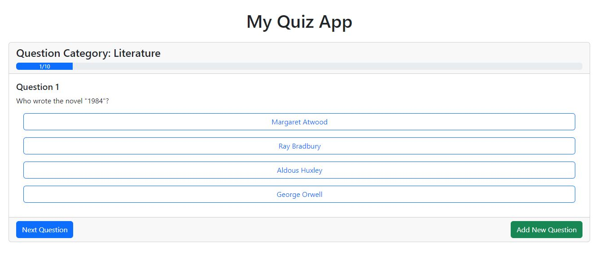
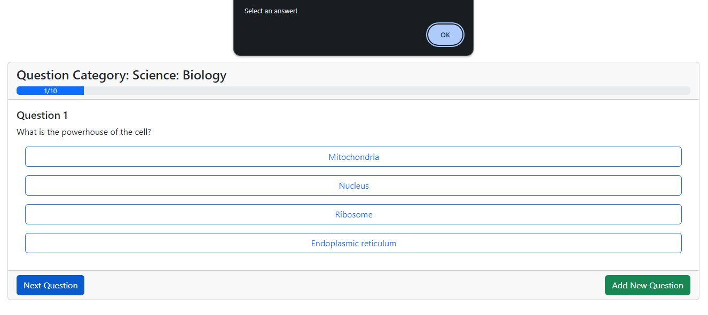
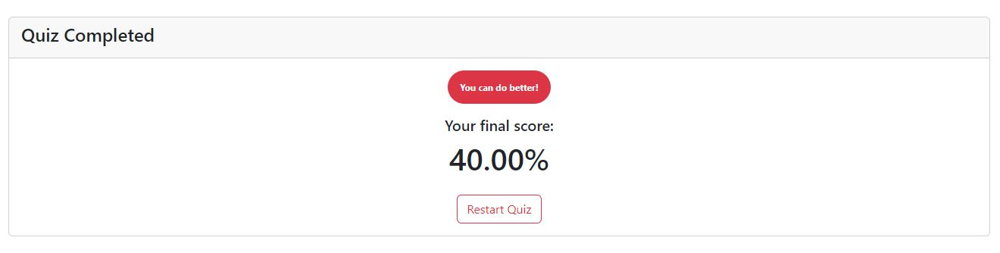
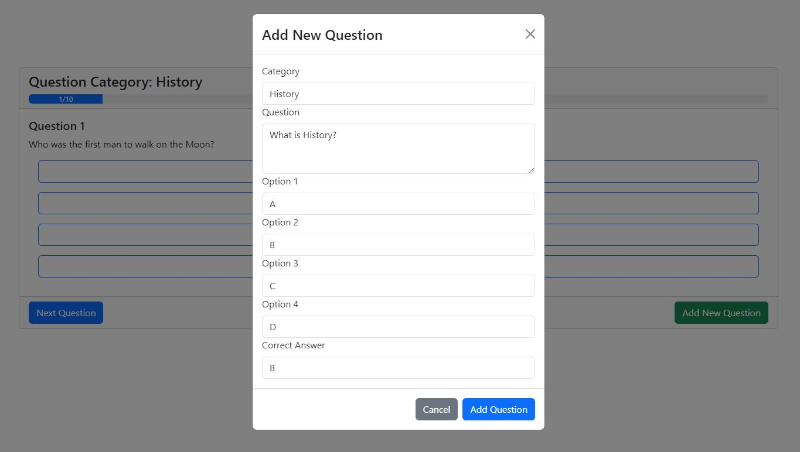

# Progmatic - React Modulzáró - MyQuiz App

## A feladat leírása

Cél: A feladat célja, hogy létrehozzunk egy dinamikus kvíz alkalmazást a következők segítségével: komponens-szerkezet, állapotkezelés, eseménykezelés, feltételes renderelés és JSON server.

## Feladat áttekintése:

A feladat egy kvíz alkalmazás készítése React használatával. Az alkalmazás lehetővé teszi a felhasználók számára, hogy válaszoljanak a kvíz adatbázis kérdéseire, láthassák az előrehaladásukat, és a befejezés után megtekinthessék végső pontszámukat. Emellett EXTRAKÉNT az alkalmazás lehetővé teszi új kérdések hozzáadását is a kvízhez, mely adatokat a JSON server segítségével tároljuk és kérjük le.

A feladathoz tartozó kérdésbankot JSON server-en keresztül kell lekérni, amely a kérdések és válaszok adatait szolgáltatja. Az adatbázis kérdéseit egy REST API végponton keresztül érheted el a JSON server használatával.

A feladathoz tartozó kérdésbankot tartalmazó `json`-t itt találod: [Kérdésbank](./assets/quizData.js)

### Megvalósítandó funkciók:

1. Kvíz kérdések véletlenszerűsítése: Valósítsd meg a kérdések és hozzájuk tartozó válaszopciók sorrendjének véletlenszerűsítését, hogy minden egyes alkalommal egyedi kvíz induljon. (Alapból minden kérdésre az első válasz a helyes a kérdésbankban.)

2. Kérdések navigációja: A felhasználó választás után a következő kérdés gombra kattintva léphessen a következő kérdésre. Validáld a válaszadást, hogy biztosan legyen kiválasztott opció a továbblépés előtt. Amennyiben nincs, jeleníts meg egy alertet.

3. Pontozás és előrehaladás: Tartsd nyilván a felhasználó pontszámát és jeleníts meg egy progress bar-t, amely jelzi, hogy hanyadik kérdésnél tart a felhasználó.

4. Az eredmény dinamikus megjelenítése: A kvíz befejezése után jelenítsd meg a felhasználó pontszámát egy személyre szabott üzenettel, attól függően, hogy milyen eredményt ért el a felhasználó. Legyen egy `restart` gomb a kvíz újrakezdéséhez (újból véletlenszerű sorrendben legyenek a kérdések).

### EXTRA

Új kérdések hozzáadása: Hozz létre egy modalt, amely lehetővé teszi a felhasználók számára, hogy új kérdéseket adjanak hozzá a kvízhez. Validáld az űrlapot, hogy csak az összes információ megadása után legyen sikeres a létrehozás, majd ennek megfelelően frissítsd a kérdéseket.

## Feladat javasolt lépései:

1. Beállítás és kezdeti konfiguráció: Forkold ezt a repository-t és hozz létre egy vite projectet. Telepítsd a szükséges függőségeket.

1. A kvíz alaplogikájának megvalósítása: Kezdd a kérdések megjelenítésével, a kiválasztott válaszok kezelésével és a pontszámítás logikájával. A válaszadás után történjen meg a pontszámítás és a következő kérdés jelenjen meg, valamint firssüljön a status bar.

1. Tervezés és stílusozás: A képek csak javaslatok a megjelenítéshez, a végleges dziájnod eltérhet ettől.
   Tipp: A kérdések megjelenítésénél a gombok valójában csak szépen stílusozott `radio` input-ok .

1. EXTRA: Új kérdés hozzáadása: Valósítsd meg az új kérdések hozzáadását egy modál segítségével. Biztosítsd, hogy az űrlap minden szükséges információt rögzít és ennek megfelelően frissíti a kvíz adatokat.

1. Végső simítások és tesztelés: Finomítsd a felhasználói felületet és alaposan teszteld le az alkalmazást. Győződj meg róla, hogy minden funkció a vártnak megfelelően működik, és nincsenek hibák.

## Pontozás:

### 1. **Kérdések megjelenítése és véletlenszerűsítés** (10 pont)

- **Kérdések lekérése a JSON server-ről** (4 pont): A kvíz kérdéseit helyesen kéri le a JSON server-ről.
- **Kérdések és válaszok véletlenszerűsítése** (4 pont): A kérdések és a hozzájuk tartozó válaszopciók véletlenszerűsítése helyesen működik minden kvíz indításakor.
- **Feltételes renderelés** (2 pont): A kérdések megfelelően jelennek meg, és a rendszer képes kezelni az esetleges üres adatokat (pl. ha a JSON server nem ad vissza kérdést).

### 2. **Válaszadás és navigáció** (10 pont)

- **Válaszadási lehetőség** (5 pont): A felhasználó kiválaszthatja a válaszokat a kérdésekre, és a választás megfelelően tárolódik.
- **Navigáció a kérdések között** (3 pont): A felhasználó válasz után helyesen léphet a következő kérdésre.
- **Válaszvalidáció** (2 pont): Ha a felhasználó nem választ ki semmit, egy figyelmeztetés jelenik meg, és nem léphet tovább.

### 3. **Pontszámítás és előrehaladás (progress bar)** (10 pont)

- **Pontszám helyes kiszámítása** (5 pont): A felhasználó válaszai alapján a rendszer helyesen számolja a pontokat.
- **Progress bar működése** (3 pont): A progress bar helyesen jelzi a felhasználó előrehaladását a kérdések között.
- **Átlagos helyes válaszok megjelenítése** (2 pont): A felhasználó láthatja a kvíz végén, hogy hány kérdésre válaszolt helyesen.

### 4. **Az eredmény dinamikus megjelenítése** (10 pont)

- **Eredmény kiszámítása és megjelenítése** (5 pont): A kvíz végén a rendszer helyesen számolja ki a végső eredményt és megjeleníti azt.
- **Személyre szabott üzenet** (3 pont): Az eredmény függvényében személyre szabott üzenetet jelenít meg (pl. kiváló teljesítmény vagy bátorítás a jobb eredményhez).
- **Kvíz újraindítása (Restart gomb)** (2 pont): A felhasználó újrakezdheti a kvízt a restart gombbal, és a kérdések újra véletlenszerű sorrendben jelennek meg.

### 5. **Stílus és megjelenés** (5 pont)

- **Reszponzív dizájn** (2 pont): Az alkalmazás reszponzív, mobilon és asztali nézetben is jól használható.
- **Felhasználóbarát felület** (2 pont): Az alkalmazás felhasználóbarát és könnyen használható.
- **Egységes stílus** (1 pont): Az alkalmazás stílusa konzisztens az összes komponens között.

### 6. **Hibakezelés és validáció** (5 pont)

- **Hibás adatkezelés** (3 pont): A rendszer megfelelően kezeli az esetleges hibákat (pl. JSON server nem érhető el, vagy hibás adat érkezik).
- **Űrlapok validálása** (2 pont): A felhasználó csak helyes adatokat tud beküldeni (pl. minden kérdés esetén ki kell választani egy válaszlehetőséget).

---

# **Összesen: 50 pont**

### EXTRA (10 pont)

- **Új kérdések hozzáadása** (10 pont): Az új kérdések sikeres hozzáadása egy modál segítségével. Az adatokat a JSON serveren keresztül kell tárolni, és a kvíz adatait dinamikusan frissíteni kell.
